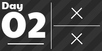

# advent_of_code
My solutions for each of the days of advent of code
I will default to doing the solutions in R but if I am feeling cheeky I will challenge myself to do them in python or another language.
To make a jupyter notebook a python script.
```
jupyter nbconvert --to script {PATHTOCODE}
```

<!-- AOC TILES BEGIN -->
<h1 align="center">
  2023 - 4 ⭐
</h1>
<a href="2023/01/code/01.r">
  
</a>
<a href="2023/02/code/02.r">
  
</a>
<h1 align="center">
  2022 - 18 ⭐
</h1>
<a href="2022/01/code/01.r">
  
</a>
<a href="2022/02/code/02.r">
  
</a>
<a href="2022/03/code/03.r">
  
</a>
<a href="2022/04/code/04.r">
  
</a>
<a href="2022/05/code/05.r">
  
</a>
<a href="2022/06/code/06.r">
  
</a>
<a href="2022/07/code/07.r">
  
</a>
<a href="2022/08/code/08.r">
  
</a>
<a href="2022/09/code/09.r">
  
</a>
<h1 align="center">
  2021 - 20 ⭐
</h1>
<a href="2021/01/code/01.py">
  
</a>
<a href="2021/02/code/day2.r">
  
</a>
<a href="2021/03/code/day3.r">
  
</a>
<a href="2021/04/code/day4.r">
  
</a>
<a href="2021/05/code/day5.r">
  
</a>
<a href="2021/06/code/day6.r">
  
</a>
<a href="2021/07/code/day7.r">
  
</a>
<a href="2021/08/code/day8.r">
  
</a>
<a href="2021/09/code/day9.r">
  
</a>
<a href="2021/10/code/day10.r">
  
</a>
<h1 align="center">
  2015 - 2 ⭐
</h1>
<a href="2015/01/code/01.r">
  
</a>
<a href="None">
  
</a>
<!-- AOC TILES END -->